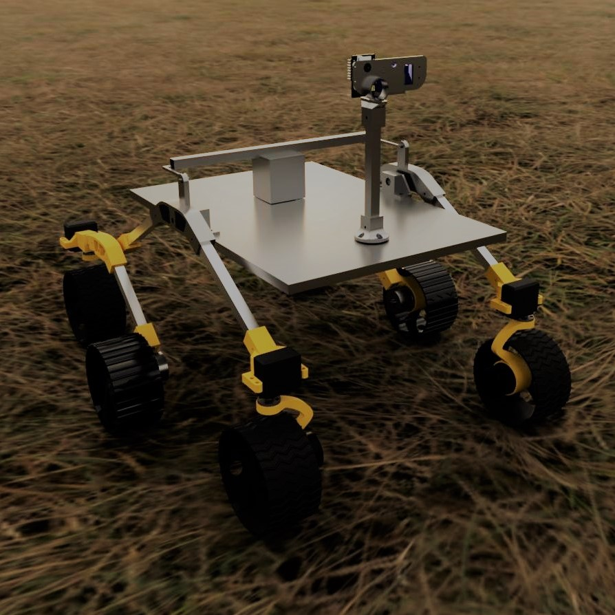
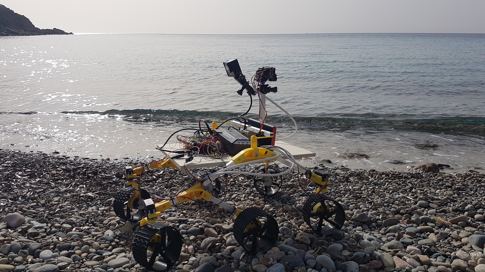
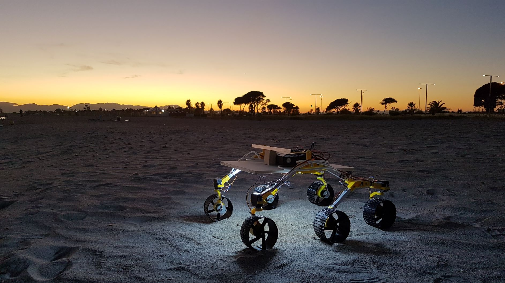
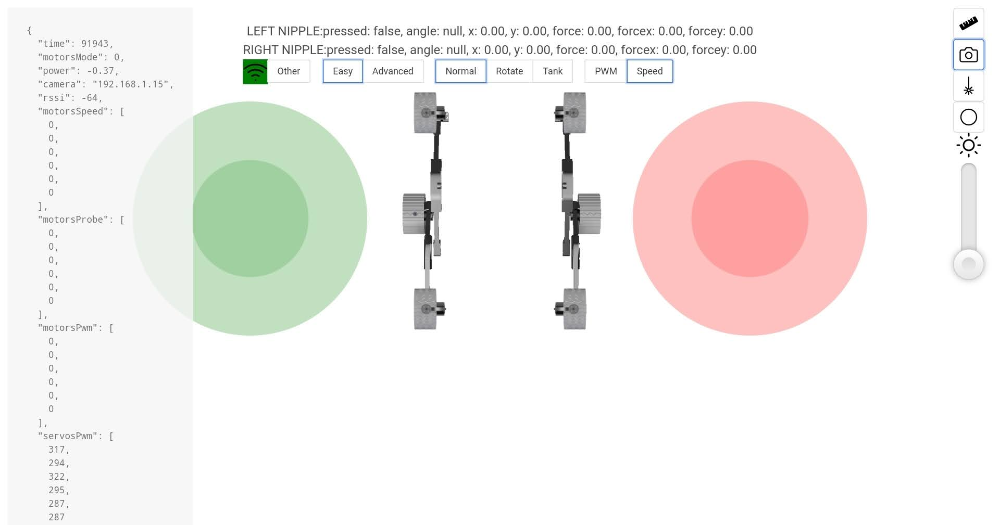

# R/C Mars Rover




It is intended to be a simple replica of a Martian rover, focusing the design on the rocker-bogie suspension system and the shape of the wheels. 
It has no cosmetic add-ons, and is simple to print and mount. In addition to the molded components, it requires the electronics, screws, some square tubes and a wood plate. 
The rover is controlled by a web application. The source code is available on GitHub. Total cost should be below 300$

[R/C Mars Rover on Thingiverse](https://www.thingiverse.com/thing:4792133)

## Electronics

Main rover parts are:
 * 4x servos for edge wheel steering 
 * 6x DC motors with internal controller
 * 1x atmega328p+ESP8266 board
 * power circuitry
 * 1x camera turret with pan and tilt servos (optional)


## Repositories

ESP8266 contains the web application:
[Rover ESP8266 code - this repository](https://github.com/flaviobattimo/rover-esp8266)

ATmega328p controls motors and servos:
[Rover atmega328p code](https://github.com/flaviobattimo/rover-328p)

Optional camera turret: [Rover esp32cam code](https://github.com/flaviobattimo/rover-turret)

## Firmware upload

All firmwares can be uploaded with VSCODE and PlatformIO.
To upload the firmware on the ESP32CAM board an additional UART programmer is required.

### Setup and first upload

Setup your working environment with VSCode and PlatformIO extension

Create a new folder

Clone all the repositories:

```bash
git clone https://github.com/flaviobattimo/rover-esp8266.git
git clone https://github.com/flaviobattimo/rover-328p.git
git clone https://github.com/flaviobattimo/rover-turret.git
```

We will first upload the rover-328p firmware. To upload the firmware to the ATMega328p configure the onboard switch appropriately:

DIP switch configuration

|    | 1  | 2  | 3  | 4  | 5  | 6  | 7  |
|  -  | - | - | - | - | - | - | - |
| **Mode 1**: ATmega328<->ESP8266  | ON | ON | OFF | OFF | OFF | OFF | OFF |
| **Mode 2**: USB <->ATmega328  | OFF | OFF | ON | ON | OFF | OFF | OFF |
| **Mode 3**: USB<->ESP8266 (Update firmware or sketch)  | OFF | OFF | OFF | OFF | ON | ON | ON |
| **Mode 4**: USB<->ESP8266 (communication)  | OFF | OFF | OFF | OFF | ON | ON | OFF |
| **Mode 5**: All independent  | OFF | OFF | OFF | OFF | OFF | OFF | OFF |

Switch the board configuration to **Mode 2** and connect the board to your PC with a usb cable 

Open the rover-328p folder with VSCode, enter the command pallette with <kbd>Ctrl</kbd>+<kbd>Shift</kbd>+<kbd>P</kbd> and run the **PlatformIO: upload** command


```bash
pip install foobar
```


## Photos and videos

The rover at the beach



At night with bottom led strip on, still without camera turret



UI interface




[](http://www.youtube.com/watch?v=kT9wiiX7X_E "Rover al poetto")

## Bill of materials

[2x PCA9685 PWM drivers](https://www.aliexpress.com/item/33006092134.html)

[2x LM2596 DC-DC converter](https://www.aliexpress.com/item/32957064724.html)

[1x UNO + WiFi-R3-AT328-ESP8266-32MB-CH340G board](https://it.aliexpress.com/item/4001355258686.html)

[3x Wire Cable Connector Terminals - 1 lot of 10 pieces](https://www.aliexpress.com/item/32921676725.html)

[6x JGB37-3525 37mm - 200RPM - 12VOLT](https://www.aliexpress.com/item/4001265315402.html)

[4x MG996R Servo](https://www.aliexpress.com/item/4000536728030.html)

[4x 10x 25T Servo Arm Round Type Disc](https://www.aliexpress.com/item/1306265255.html)

[1x ESP32-CAM WiFi Module](https://www.aliexpress.com/item/32999991632.html)

[ACS712 5a DC current sensor](https://www.aliexpress.com/item/32830307620.html)

8x MR105-2RS Rubber Sealed Ball Bearing 5 x 10 x 4mm

2x SG90 Micro servo

12 volt battery

cables

20x - 20mm x 4mm bolts (and nuts)

2x - 50mm x 5mm bolts (6 security nuts)

Wood plate 400x280x10mm

10mm square tube (Length TBD)

## Related projects

* [JPL Open Source Rover Project](https://github.com/nasa-jpl/open-source-rover)
* [Sawppy Rover](https://hackaday.io/project/158208-sawppy-the-rover)
* [ESA ExoMy](https://github.com/esa-prl/ExoMy)
